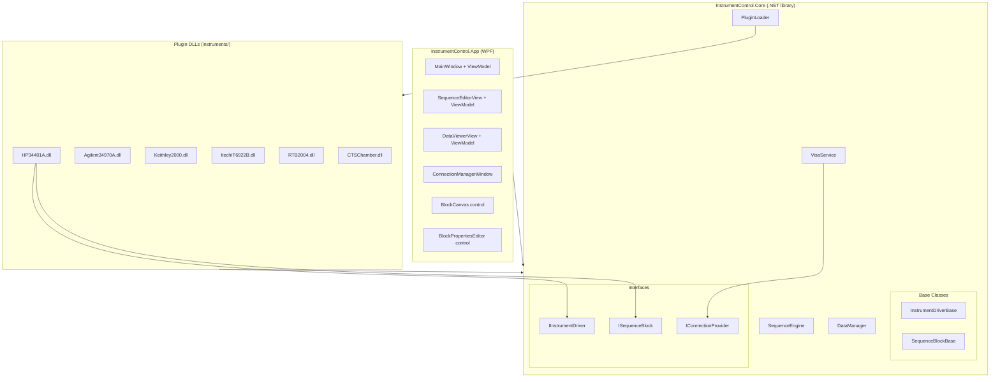
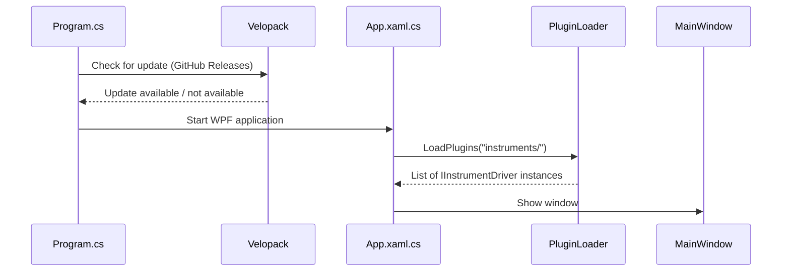
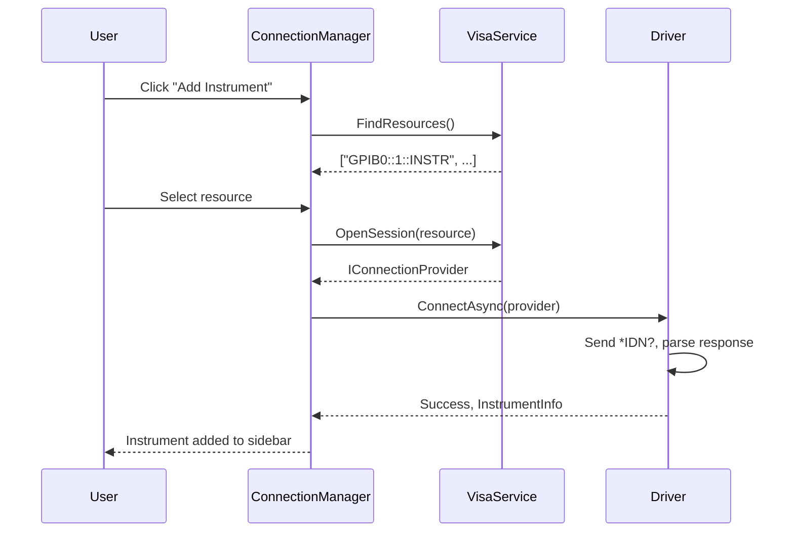
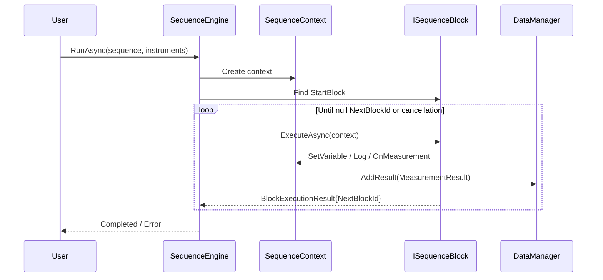

# Architecture

InstrumentControl is a layered .NET 10 WPF application. This page describes the major layers, their responsibilities, and how they interact.

---

## Solution Structure

```
InstrumentControl.sln
├── src/
│   ├── InstrumentControl.Core/    ← Core library (no WPF UI code)
│   └── InstrumentControl.App/     ← WPF executable
└── instruments/
    ├── HP34401A/                  ← Plugin DLL
    ├── Agilent34970A/             ← Plugin DLL
    ├── Keithley2000/              ← Plugin DLL
    ├── ItechIT6922B/              ← Plugin DLL
    ├── RTB2004/                   ← Plugin DLL
    └── CTSChamber/                ← Plugin DLL
```

---

## Layered Architecture



---

## InstrumentControl.Core

The core library has **no dependency on WPF** beyond what is strictly required for the `FrameworkElement` return type in `IInstrumentDriver.CreateFrontPanel()`. All business logic lives here.

### Services

| Service | File | Responsibility |
|---|---|---|
| `VisaService` | `Services/VisaService.cs` | P/Invoke to NI-VISA DLL; simulation mode fallback |
| `PluginLoader` | `Services/PluginLoader.cs` | Reflection-based DLL scanning from `instruments/` folder |
| `SequenceEngine` | `Services/SequenceEngine.cs` | Block execution state machine; BlockRegistry |
| `DataManager` | `Services/DataManager.cs` | Thread-safe result storage; CSV export |

### Interfaces

| Interface | Responsibility |
|---|---|
| `IInstrumentDriver` | Plugin contract: connect, disconnect, create front panel, provide blocks |
| `ISequenceBlock` | Block contract: define properties, execute, serialize |
| `IConnectionProvider` | Transport abstraction: open, close, write, query, read |
| `IHasBodyOutput` | Marker for blocks with body/next dual outputs (LoopBlock, ConditionBlock) |

### Base Classes

| Class | Responsibility |
|---|---|
| `InstrumentDriverBase` | Default `ConnectAsync` (IDN parse, firmware extraction); helper methods `Query()`, `Write()`, `QueryDouble()` |
| `SequenceBlockBase` | Auto-ID generation; `GetProp<T>()` helper; `Clone()`; `Serialize()`/`Deserialize()` |

### Models

| Model | Purpose |
|---|---|
| `MeasurementResult` | One data point: timestamp, instrument, channel, parameter, value, unit |
| `BlockData` | JSON-serializable block state (type, position, properties) |
| `SequenceDefinition` | A named collection of `BlockData` with metadata |
| `BlockExecutionResult` | Outcome of a block run: success flag, next block ID, optional output value |
| `BlockPropertyDefinition` | Metadata for a block property: name, editor type, options, default value |
| `SequenceContext` | Per-run context passed to every block: instruments, variables, log callback, cancellation token |
| `InstrumentInfo` | Instrument metadata: resource name, driver, firmware, serial number, connection status |

---

## InstrumentControl.App

The WPF application follows the **MVVM pattern** using `CommunityToolkit.Mvvm` source generators.

### Views and ViewModels

| View | ViewModel | Responsibility |
|---|---|---|
| `MainWindow` | `MainWindowViewModel` | Instrument list; tab navigation; toolbar commands |
| `SequenceEditorView` | `SequenceEditorViewModel` | Canvas state; run/pause/stop; file open/save |
| `FrontPanelView` | *(plugin-provided)* | Host for the plugin's `CreateFrontPanel()` element |
| `DataViewerView` | `DataViewerViewModel` | OxyPlot series; data table; CSV export |
| `ConnectionManagerWindow` | `ConnectionManagerViewModel` | VISA scan; IDN query; driver selection |
| `AboutWindow` | *(none)* | Version and license info |

### Custom Controls

| Control | Responsibility |
|---|---|
| `BlockCanvas` | Renders blocks as colored rectangles on a drag-and-drop canvas; draws connection arrows; handles mouse events |
| `BlockPropertiesEditor` | Dynamically generates WPF input controls (TextBox, ComboBox, CheckBox, etc.) from `BlockPropertyDefinition[]` |

---

## Execution Flow

### Application Startup



### Connecting an Instrument



### Sequence Execution



---

## Plugin Loading

`PluginLoader` scans `instruments/*.dll` at startup:

```csharp
// Pseudocode — see PluginLoader.cs for full implementation
foreach (var dllPath in Directory.GetFiles("instruments", "*.dll"))
{
    var assembly = Assembly.LoadFrom(dllPath);
    foreach (var type in assembly.GetTypes())
    {
        if (typeof(IInstrumentDriver).IsAssignableFrom(type) && !type.IsAbstract)
        {
            var driver = (IInstrumentDriver)Activator.CreateInstance(type)!;
            drivers.Add(driver);
        }
    }
}
```

No MEF exports are required. The `[InstrumentDriver]` attribute that appears on some drivers is for documentation only.

---

## Block Registry

`SequenceEngine` contains a static `BlockRegistry` — a dictionary mapping block type strings to factory functions:

```csharp
// Each block class registers itself in its static constructor:
static WaitBlock()
{
    BlockRegistry.Register("WaitBlock", () => new WaitBlock());
}
```

When the sequence engine loads a saved sequence JSON, it calls `BlockRegistry.Create("WaitBlock")` to instantiate the correct type. Instrument plugins register their blocks the same way — because the DLLs are loaded before any sequence is opened, all blocks are available.

---

## Connection Provider Architecture

The `IConnectionProvider` interface decouples transport from driver logic:

```
Driver code calls: provider.QueryAsync("CONF:VOLT:DC")
                          ↓
VisaConnectionProvider    → NI-VISA viWrite / viRead
CTSSerialConnectionProvider → encode frame → COM port → decode frame → return ASCII
SimulatedConnectionProvider → return hardcoded default response
```

Drivers do not know which provider is in use. Custom serial devices override `ConnectAsync()` to swap in their provider before the base class helper methods are called.

---

## Threading Model

- **UI thread:** All WPF rendering, ViewModel property changes
- **Sequence engine:** Runs on a background thread (`Task.Run`); posts results back via `Dispatcher.InvokeAsync` and `ObservableCollection.Add` thread-safe wrappers
- **DataManager:** Thread-safe via `lock (_results)` — can receive results from any thread
- **VISA calls:** Blocking I/O on the sequence engine thread; no async VISA API used
- **Pause/Resume:** Implemented via `TaskCompletionSource<bool>` — no polling, zero CPU while paused
