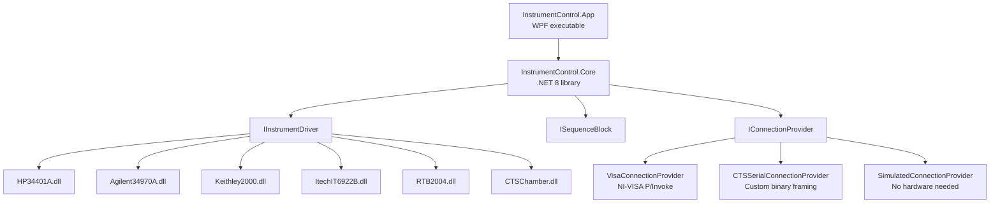

# InstrumentControl

**Universal Windows instrument control software** for VISA/GPIB/serial lab equipment.

---

## What is InstrumentControl?

InstrumentControl is a .NET 8 WPF desktop application that lets you **connect, control, and automate laboratory instruments** without writing any code. It supports standard VISA instruments (GPIB, USB-TMC, LAN/VXI-11) and custom RS-232 devices through a plugin architecture.

Key capabilities at a glance:

| Feature | Description |
|---|---|
| **Virtual front panels** | Per-instrument UI that mirrors the physical device's controls |
| **Drag-and-drop sequences** | Build automated measurement programs by connecting blocks on a canvas |
| **Live charts** | OxyPlot graphs and data tables update in real time during sequence runs |
| **Plugin DLLs** | Each instrument driver is an independent DLL — drop it in the `instruments/` folder and restart |
| **VISA auto-discovery** | Scans USB, GPIB, TCPIP and serial ports; sends `*IDN?` to identify devices automatically |
| **Simulation mode** | Runs without NI-VISA installed — ideal for sequence development on a laptop |
| **Auto-update** | Installer edition checks GitHub Releases on every launch and applies delta updates |
| **UI language** | [English and Polish](user-guide/language.md) — switch any time from the About dialog, no restart required |

---

## Supported Instruments

| Instrument | Type | Interface |
|---|---|---|
| [HP 34401A](user-guide/instruments/hp34401a.md) | 6½-digit DMM | VISA (GPIB / USB / RS-232) |
| [Agilent 34970A](user-guide/instruments/agilent34970a.md) | DAQ / Switch Unit | VISA (GPIB / USB) |
| [Keithley 2000](user-guide/instruments/keithley2000.md) | 6½-digit DMM | VISA (GPIB / USB) |
| [ITECH IT6922B](user-guide/instruments/itech-it6922b.md) | DC Power Supply 60 V / 5 A | VISA (USB / LAN / GPIB) |
| [R&S RTB2004](user-guide/instruments/rtb2004.md) | 4-channel Oscilloscope 300 MHz | VISA (LAN / USB) |
| [CTS T-40/50](user-guide/instruments/cts-chamber.md) | Environmental Chamber −75 … +185 °C | RS-232 (custom binary protocol) |

---

## Quick Navigation

-   :material-download: **[Installation](user-guide/installation.md)**

    ---

    System requirements, installer vs portable ZIP, NI-VISA setup.

-   :material-rocket-launch: **[Quick Start](user-guide/quick-start.md)**

    ---

    Connect your first instrument and run a measurement in 5 minutes.

-   :material-puzzle: **[Sequence Editor](user-guide/sequence-editor.md)**

    ---

    Build automated measurement programs with drag-and-drop blocks.

-   :material-code-braces: **[Plugin Development](developer-guide/plugin-development.md)**

    ---

    Write a new instrument driver in ~100 lines of C#.

---

## Architecture Overview

See the [Architecture](developer-guide/architecture.md) page for a detailed walkthrough.
